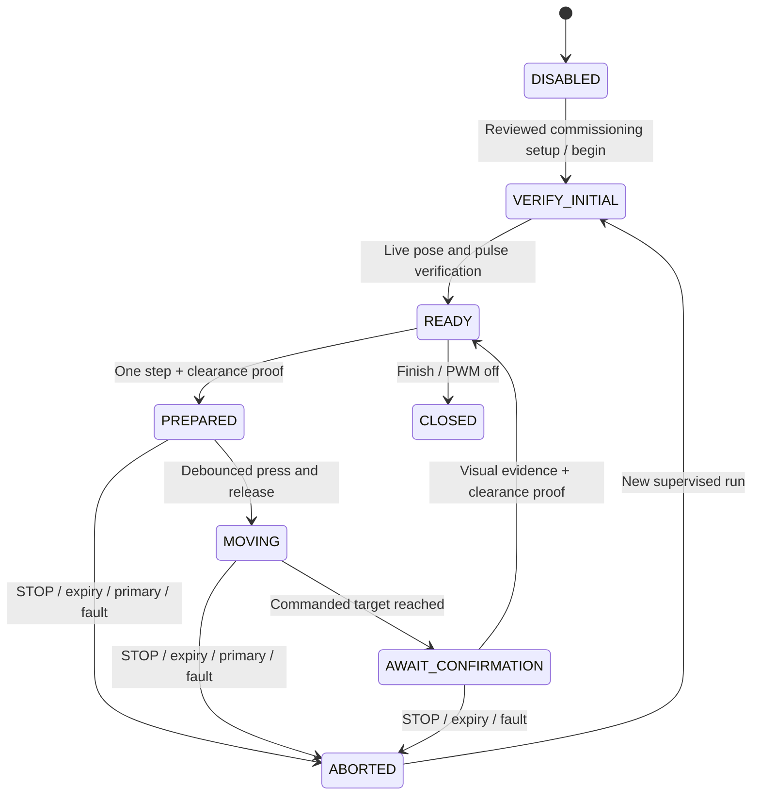

# CAL-1 — reusable supervised neck calibration and health

Independent interrupted-session recovery and malformed-telemetry correction:
[CAL-1-recovery-validation.md](CAL-1-recovery-validation.md). Physical acceptance
remains pending; this software validation does not authorize deployment.

Base: `b29ee2b3dc9b2a5c5eb353ee296c270f02601472`, branch
`feature/active-vision`. Physical authorization remains **false**. Implementation
and tests use fake hardware. No firmware was flashed, servo PWM physically
created, external power switched, physical motion initiated, or gameplay run.
Existing recovery, Robotron evidence and Pico backups are retained.

The [validation record](validation-cal1.json) reports 609 broader tests passed
and 19 Torch-dependent skips. [Archived simulated evidence](cal1-simulation-01/summary.json)
preserves a complete supervised grid trace and conservative CANDIDATE profile;
it is explicitly simulated and cannot qualify physical motion.

## Implemented authority and lifecycle

`rp2040/calibration.py` supplies calibration intent, state and evidence;
`rp2040/servos.py` remains the only PWM owner. There is one PWM creation site.
Only GP4/GP5 can receive actuator objects. Head B GP14/GP15 stays inactive.
Normal motion, calibration, watchdog, STOP, sessions/epochs and ownership share
the existing authority and output-disable implementation.

The shipped deployment profile retains no envelope, false electrical gate and
no normal arm input. Additional defaults are `CALIBRATION_PROFILE=None`,
`CALIBRATION_INPUT_ENABLED=False`, `AUTONOMOUS_MOTION_ENABLED=False` and
`PERSISTENT_PROFILE_DIRECTORY=None`. No commissioning angles, initial servo
pulse or successful position have been invented. The former local arm routine
now additionally refuses unqualified profiles and requires a fresh live
operator verification. `LOCAL_ARM_PIN=10` is explicitly forbidden at boot.

GP10 is exclusively the temporary calibration input, GP10 → GND, internal
pull-up. A stable released HIGH, pressed LOW and released HIGH (each stable
for at least 60 ms) produces one event **on release**. Startup-held contact,
bounce and repeated polling do not produce permits. Touching it without a
prepared step does not create PWM. GP10 is **not an emergency stop**.



The diagram's commissioning transition requires a future reviewed firmware
setup; serial requests cannot supply an arbitrary envelope or clear gates.
`begin` refuses an armed head or primary-owned task. `verify` attests an actual
assembled-head pose and independently established angle-to-pulse mapping,
clearance, independent power cutoff, and external servo power OFF. VIEWPOINT
estimates are never acceptable as the physical verification. First PWM uses
that exact verified pose, rather than presumed HOME or 90 degrees.

Every prepared step is single-axis, within a reviewed convex combined-axis
region and its positive inward clearance margin. Hard commissioning ceilings
are one degree per step and two degrees/second; these are rejection ceilings,
not assertions of safe assembled-head travel. The reviewed commissioning
profile must supply suitable smaller limits. The whole interpolated segment
lies within the convex region; unsafe combinations are rejected even if both
individual endpoint angles appear allowed. Nonconvex clearance must be split
into an independently reviewed conservative convex operating region, not
approximated by unrestricted independent limits.

Each step has a unique identifier and is consumed once. Held/bounced contacts,
stale epochs, missing verification, reused steps, missing visual evidence,
unconfirmed steps and out-of-region/rate requests fail closed. After completion,
PWM may hold the verified estimate while awaiting operator inspection; no
further movement is allowed. Each verification/preparation/movement/confirmation
stage and the next-step readiness window has a 30-second deadline; heartbeat
cannot prolong it. The existing communication watchdog remains effective.
Timeout, STOP, reconnect, primary takeover, input failure or evidence failure
revokes permits and disables both PWMs. Re-entry requires new verification;
reboot never restores a run, step or grant. Evidence capacity is bounded; full
logs require archival/reboot rather than losing prior entries or continuing.

Events record run/session/epoch, direction, requested and commanded pose,
operator evidence references, visual displacement, permits, completion and
interruptions. Firmware events are streamed over the existing UART transport.
The Pi console fsyncs requests and events to a new JSONL file, optionally using
the existing EvidenceJournal. A reboot before pending UART events are received
can truncate a run; incomplete or discontinuous evidence cannot qualify a
profile. No uninterrupted forensic logging through physical power loss is
claimed.

## Versioned profiles and independent qualification

`hardware.neck_calibration.ProfileRepository` preserves immutable profile
versions, SHA-256 selection pointers, timestamps, superseded identifiers,
selection history and sticky quarantine files. The shared schema and RP2040
loader reject missing, damaged, incompatible, unverified, simulated or
quarantined profiles. Boot does not energize outputs even with a valid profile.
The original evidence and profile versions are never overwritten by a new
calibration.

Before normal PWM activation a durable `.running` marker is written. A clean
STOP/IDLE/SLEEP/primary handoff clears it after disabling outputs; health
uncertainty, watchdog failure or an unclean reboot retains it. The RP2040
loader blocks reuse even if a quarantine write failed. Missing/quarantined
normal profiles do not fall back to an older static profile. Supervised CAL-1
can still be re-entered using a separately reviewed commissioning setup and
the electrical gate; no autonomous profile is active in that case.

Conservative derivation requires a completed uninterrupted trace with every
movement confirmed, a fully observed Cartesian grid of at least 3×3 combined
poses, nonzero consistent signed visual responses for both axes, and all tested
poses inside commissioning constraints. It shrinks the tested region by an
explicit positive margin and interpolates the already reviewed pulse mapping.
It never expands past observed endpoints. Sparse observations or failed
movement cannot qualify a profile. This grid is minimum evidence, not proof
that hidden mechanical clearance between samples is safe.

A derived profile is CANDIDATE. A separate reviewer must supply a preserved
physical qualification report binding the candidate/evidence hashes, actual
interval clearance, initial pulse alignment, post-torque-release stability,
watchdog and independent power-cutoff checks. The calibration operator cannot
self-qualify. Simulated evidence is permanently ineligible. Qualification creates
a new immutable QUALIFIED version; selection retains the superseded history.
No tool selection flashes firmware or activates PWM.

After separately authorized installation, RP2040 loads the selected qualified
version from its persistent filesystem. Normal startup still requires a fresh
operator-confirmed pose/pulse association with servo power OFF, then an explicit
scoped `AUTOSTART` under the electrical gate. This creates PWM at the verified
pose and grants no Active Vision ownership itself. Active Vision obtains its
existing scoped grant and then makes autonomous bounded adjustments. **GP10 is
not required for activation or ordinary autonomous movement.** STOP and every
reboot revoke activation; qualification is not permanent permission to energize
an unknown starting pose.

Normal activation also requires a persistent quarantine callback. A profile
with uncertain safety cannot simply be reused after a reboot. Calibration can
be entered again under the reviewed commissioning setup; replacement requires
fresh independent qualification and preserves the quarantined predecessor.

## Neck health and Learning Executive

`hardware.neck_health.NeckHealth` consumes already available observations and
RP2040 telemetry. It adds no capture owner, optimization worker or background
visual inference. For each commanded movement it checks the commanded estimate,
settled state, observed displacement and calibrated visual response direction
and magnitude. Missing or inconsistent movement evidence triggers immediate
STOP, authorization revocation and whole-profile quarantine. It never retries
a possibly obstructed motion to discover the obstruction.

Persistent unexpected viewpoint change is separately checked with hysteresis;
expected scene transitions suppress that trigger. A missing target without a
pending physical move is recorded as uncertain visual tracking, not a confirmed
mechanical fault. All safety reports preserve alternatives: occlusion, scene
activity, focus/exposure, mount motion, electrical/wiring and possible mechanical
degradation. Visual response is task/view dependent; disagreement can request
recalibration even if the cause is nonmechanical. No measured joint position,
force sensor or reliable mechanical fault diagnosis is claimed.

Qualified autonomous Active Vision constructs the monitor automatically and
checks movement evidence before another trial. LOCKED still terminates the
optimizer and releases the camera. A primary task wanting continuing health
checks calls `NeckHealth.observe()` with its existing geometry/telemetry and
its scene-transition flag; it must not start a second camera or resurrect the
optimizer. Passive observation/digital correction remain available after
quarantine, subject to existing camera ownership. A lost physical UART means
host STOP cannot guarantee immediate delivery; firmware watchdog and the
independent power cutoff remain essential.

`executive_context()` exposes profile status, uncertainty, allowed passive
resources and a supervised recalibration request. `reflect_to_executive()`
uses the existing EvidenceJournal, Reflection proposal policy and Learning
Executive. The resulting project remains blocked without supervision,
electrical clearance and separately authorized physical methods. It cannot
clear quarantine or arm motion. No ALA-2 branch or unfinished implementation
is modified. Your additional criterion ended at “Expose”; these interfaces and
an independently tested blocked Executive proposal implement the visible
integration requirement.

## Pi staging now — code only, no hardware access

Use the full published CAL-1 SHA from the completion report below. These
commands preserve the old recovery and safe-authority checkouts, untracked
files, backups and Robotron archives. They stage and run fake-hardware tests:

```bash
RELEASE_SHA='FULL_CAL1_SHA_FROM_COMPLETION_REPORT'
CAL_STAGE="$HOME/charlie-cal1"
test ! -e "$CAL_STAGE" || exit 1
git clone --single-branch --branch feature/active-vision https://github.com/mrgarmise/charlie.git "$CAL_STAGE"
cd "$CAL_STAGE" || exit 1
git checkout --detach "$RELEASE_SHA"
git merge-base --is-ancestor b29ee2b3dc9b2a5c5eb353ee296c270f02601472 HEAD || exit 1
python3 -m venv --system-site-packages .venv
.venv/bin/python -m pip install pytest numpy opencv-python-headless Pillow pyserial
.venv/bin/python -m pytest -q tests/test_neck_calibration.py tests/test_active_vision_firmware.py tests/test_head_recovery_lockout.py tests/test_active_vision.py tests/test_passive_eyes.py
.venv/bin/python -c "from pathlib import Path; p={}; exec(Path('rp2040/motion_profile.py').read_text(),p); assert p['CALIBRATED_ENVELOPE'] is None and p['CALIBRATION_PROFILE'] is None and p['ELECTRICAL_GATE_CLEARED'] is False and p['LOCAL_ARM_PIN'] is None and p['AUTONOMOUS_MOTION_ENABLED'] is False"
```

Do not run sync, mpremote, the supervised console, live camera control or
gameplay as part of this staging. Pi-native and real MicroPython validation
remain pending.

## Future supervised procedure — blocked pending explicit authorization

1. Resolve the Keyestudio shield's power/USB behavior and verify an independent
   servo-power cutoff that remains usable if firmware/UART stalls. The GP10
   input test alone does not clear this electrical gate. Keep Head B disconnected.
2. Preserve existing full Pico backups; capture a fresh full filesystem backup
   into a new directory with the established recovery method and hash it. Never
   replace the original backups. Firmware installation needs separate explicit
   authorization; no command here grants it.
3. In an isolated maintenance setup, install the shipped disarmed firmware first
   using the existing `python -m tools.sync_rp2040` **only when authorized**.
   Confirm startup DISARMED, no actuator PWM and no change on GP10 contact.
   Enabling `CALIBRATION_INPUT_ENABLED=True` connects only the GP10 input.
4. Independently review a provisional commissioning profile before enabling
   calibration: `commissioning_reviewed=True`, unique calibration ID, pins
   `[4,5]`, finite `pan`/`tilt` angle and pulse intervals, a CCW strictly convex
   `clearance_polygon`, positive `commissioning_margin`, `max_step<=1`,
    `max_rate<=2`, independently established `confirmed_arm_pose`/`home_pose`.
    Include `observation_size=[width,height]` for the full-field observation
    reference used to measure displacement. Use consistently ordered screen
    corners and their mean raw-pixel displacement for calibration confirmations.
    Normal health checks convert normalized geometry back into these reference
    pixel units; changing crop/FOV or reference geometry needs requalification.
   Do not use old unloaded travel limits or presumed 90-degree alignment. Save
   its exact JSON as commissioning evidence. Supply the matching dictionary as
   `CALIBRATION_PROFILE` in the separately reviewed deployment; keep normal
   `CALIBRATED_ENVELOPE=None`, `LOCAL_ARM_PIN=None` and autonomous enable false.
   Clearing the electrical gate and installing that configuration requires the
   resolved hardware setup and explicit authorization.
5. With external servo power OFF, independently inspect both actual joint
   alignments and their pulse association. If either is unknown, stop here and
   use a separately authorized disconnected/unloaded alignment procedure.
   Never infer these from VIEWPOINT or enable a presumed starting pulse.
6. Start the console only under the separate supervised calibration authorization:

```bash
cd "$HOME/charlie-cal1" || exit 1
.venv/bin/python -m tools.calibrate_neck \
  --authorize-supervised-calibration \
  --port /dev/ttyACM0 \
  --evidence "$HOME/cal-1-supervised-NEW_RUN.jsonl"
```

The explicit console flag cannot override a missing commissioning profile or
firmware gates. Opening UART sends STOP and a fresh session. The console takes
one JSON operation per line; it handles current session/epoch automatically.
Names below are examples of identifiers, **not physical poses**. Replace pose,
rate and visual displacement placeholders with reviewed/observed values before
entering an operation. Do not report true for an unchecked prerequisite:

```json
{"op":"begin","run_id":"cal_run_001"}
{"op":"verify","run_id":"cal_run_001","pose":["VERIFIED_PAN","VERIFIED_TILT"],"operator":"operator_001","evidence":"initial_photo_001","pose_verified":true,"pulse_mapping_verified":true,"clearance_verified":true,"cutoff_verified":true,"external_power_off":true}
{"op":"prepare","run_id":"cal_run_001","step_id":"cal_step_001","pose":["REVIEWED_PAN","REVIEWED_TILT"],"rate":"REVIEWED_RATE","operator":"operator_001","evidence":"clearance_photo_001","clearance_verified":true,"cutoff_verified":true,"supervised":true}
{"op":"confirm","run_id":"cal_run_001","step_id":"cal_step_001","visual_displacement":["OBSERVED_DX_PIXELS","OBSERVED_DY_PIXELS"],"operator":"operator_001","evidence":"result_photo_001","clearance_verified":true,"no_binding":true,"settled":true,"supervised":true}
{"op":"finish","run_id":"cal_run_001"}
```

7. Keep GP10 separated long enough to debounce before prepare. Inspect clearance
   for the single-axis incremental target, prepare it, then under the authorized
   setup restore servo power with the independent cutoff within reach. Touch
   GP10 to GND and release: this permits one step. Do not hold contact expecting
   repeats. Inspect actual movement, cable clearance, stability and signs of
   binding. Cut servo power immediately if anything is unsafe; GP10 cannot stop
   a step. Ctrl-C/EOF sends STOP but is not a substitute for the power cutoff.
8. Record displacement of a stable physical visual reference using the existing
   observation window; confirm only after inspection. No confirmation means no
   next movement, and timeout disables PWM. Failed or unexplained movement ends
   the run; never drive repeatedly against a suspected obstruction. Save raw
   observation/photo references separately with the JSONL evidence. Work through
   reviewed combined poses, not arbitrary endpoint probing.
9. Finish the run and verify PWM off, then turn external servo power OFF. Derive
   a candidate offline; supply an actually justified positive margin:

```bash
.venv/bin/python -m tools.neck_profiles --repository "$HOME/charlie-neck-profiles" derive \
  --evidence "$HOME/cal-1-supervised-NEW_RUN.jsonl" \
  --commissioning "$HOME/cal-1-commissioning-REVIEWED.json" \
  --id candidate_NEW_VERSION --margin REVIEWED_MARGIN
```

For re-calibration add `--supersedes PRIOR_QUALIFIED_ID` and preserve all earlier
profiles/evidence. This command opens no hardware and cannot activate motion.
10. Independent reviewer creates `charlie-neck-qualification-v1` JSON containing
    reviewer, candidate ID, canonical candidate SHA-256, source evidence SHA-256,
    `simulated=false`, and truthful boolean proofs for `physical_validation`,
    `interval_clearance_verified`, `initial_pulse_verified`,
    `torque_release_verified`, `watchdog_and_cutoff_verified`. Hash the canonical
    candidate using `hardware.neck_calibration.encode`; preserve the report.
    Then offline qualification/selection is:

```bash
.venv/bin/python -m tools.neck_profiles --repository "$HOME/charlie-neck-profiles" qualify \
  --candidate candidate_NEW_VERSION --id qualified_NEW_VERSION \
  --reviewer independent_REVIEWER --review "$HOME/cal-1-independent-review.json"
.venv/bin/python -m tools.neck_profiles --repository "$HOME/charlie-neck-profiles" select \
  --id qualified_NEW_VERSION
```

11. Under separate firmware-deployment authorization, preserve the Pico profile
    directory and quarantine/history files. Copy the new immutable qualified
    JSON and its `.activation-history.json` with the existing MpRemote helper,
    then copy `activation.json` last into `/neck_profiles`. Never overwrite an
    existing immutable version, erase quarantine or discard prior files. Configure
    `PERSISTENT_PROFILE_DIRECTORY='/neck_profiles'`,
    `AUTONOMOUS_MOTION_ENABLED=True`, `LOCAL_ARM_PIN=None`; retain the independent
    electrical gate. Firmware reboot only loads metadata and remains DISARMED.
    The supervisor supplies `START_VERIFY <session> <epoch> <verification JSON>`
    (same five verification flags and actual pose as above), then
    `AUTOSTART <session> <epoch>` under authorized activation conditions. It
    does not grant Active Vision ownership; use the existing checked request
    API after that activation. Do not leave the supervised CAL console polling
    during normal operation. GP10 is not part of the normal movement protocol.

For step 11, the following copy block is **firmware maintenance**, not code-only
staging. It requires the separate authorization, resolved electrical setup,
external servo power OFF and fresh full Pico backup described above. Run it
only after those conditions are met; it is not run during this implementation:

```bash
.venv/bin/python - <<'PY'
from pathlib import Path
from hardware.neck_calibration import ProfileRepository
from tools.mpremote_helper import MpRemote, MpRemoteError
repository = ProfileRepository(Path.home()/'charlie-neck-profiles')
profile = repository.active()
name = profile['calibration_id']
backup = Path.home()/('cal-1-profile-pointer-backup-'+name)
backup.mkdir(exist_ok=False)
mp = MpRemote()
mp.require()
assert mp.is_connected(), 'No maintenance Pico'
try:
    listing = mp.run('fs','ls',':neck_profiles').stdout
except MpRemoteError:
    mp.mkdir(':neck_profiles')
    listing = mp.run('fs','ls',':neck_profiles').stdout
assert name+'.json' not in listing, 'Never overwrite an immutable Pico version'
if 'activation.json' in listing:
    mp.run('fs','cp',':neck_profiles/activation.json',str(backup/'previous-activation.json'))
for filename in (name+'.json',name+'.activation-history.json','activation.json'):
    mp.copy(repository.directory/filename,':neck_profiles/'+filename)
mp.reset()
PY
```

This preserves previous version/quarantine files and saves the previous pointer.
It does not configure or grant normal activation; the RP2040 configuration and
fresh START_VERIFY/AUTOSTART prerequisites above still apply. Actual upload,
power-loss atomicity and MicroPython filesystem durability remain physically
unvalidated.

## Rollback and remaining gates

Code rollback stages the prior checkpoint without resetting either project:

```bash
cd "$HOME/charlie-cal1" || exit 1
CAL_ROLLBACK="$HOME/charlie-cal1-rollback-b29ee2b"
test ! -e "$CAL_ROLLBACK" || exit 1
git worktree add --detach "$CAL_ROLLBACK" b29ee2b3dc9b2a5c5eb353ee296c270f02601472
```

Actual firmware rollback is separately authorized maintenance: restore the
known DISARMED recovery application from `8777955`, preserving support-library
safety fixes and backups, with `main.py` last, using the procedure in
[safe-motion-authority.md](safe-motion-authority.md). Never roll back to an older
energizing startup firmware. A quarantined profile is not made safe by selecting
an old copy; leave physical enable false until qualified replacement.

Outstanding physical validation: electrical topology and independent cutoff,
actual initial alignment/pulse mapping, assembled-head commissioning constraints,
GP10 debounce under real wiring noise, real MicroPython/Pico execution, PWM/rate
and watchdog measurement, mechanical clearance throughout the derived region,
visual response reliability, post-STOP sag/stability, real camera ownership,
physical persistence/rollback and an actual independent qualification. CAL-1 is
implemented and fake-hardware tested; physical neck calibration and autonomous
physical Active Vision are not claimed operational.
